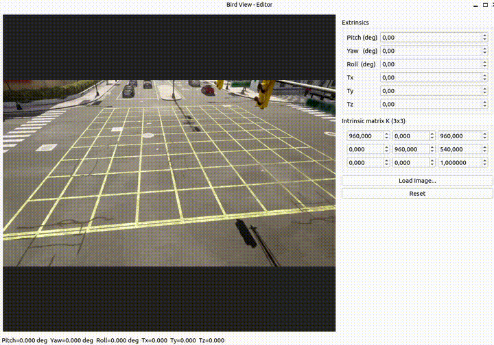
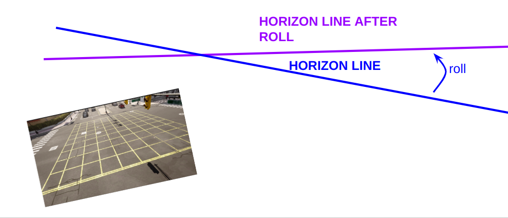

# Bird view transformation

I assume that *bird’s-eye view* is equivalent to a *top-down view*. So, the problem is the following: we have a calibrated pinhole camera, and we want to map every image taken by this camera to a top-down view.

In the general case, the perfect mapping between two pinhole cameras is

$\tilde{x'} = K(R \, \lambda K^{-1}x + T)$

where I put a tilde on ~ on $\tilde x’$ to specify homogeneous coordinates.

This means we need to estimate:

- **R**: the rotation between the two views,
- **T**: the translation between the two projection centers, and
- **λ:** the depth for each pixel in the images.

Estimating **R** and **T** corresponds to estimating the **essential matrix**, which requires at least 5 correspondences between the two images. Estimating the depth **λ** for each pixel falls into the domain of depth estimation, which is a much more difficult problem.

A good way to simplify the problem is to reduce the mapping to a **homography**, either by:

- considering your transformation as a **pure rotation** (sufficient for aerial acquisition, for example), or
- assuming all points lie in the same plane (useful for car-mounted cameras where most points lie on the road, though vehicles will be largely distorted).

### Case 1: pure rotation

Here, we only need to estimate the relative rotation between the current view and the top-down view. The mapping is:

 $x' = KRK^{−1} x$ .

Example:

```python
K_inv = np.linalg.inv(K)
R_inv = R.T  # inverse of rotation matrix
H = K @ R_inv @ K_inv
warp_image = cv2.warpPerspective(image, H, (image.shape[1], image.shape[0]), flags=cv2.INTER_LINEAR)
```


### Case 2: Rotation + translation

If we want to add translation, you can use the well-known homography formula that maps points in a plane seen from one camera to another:

$H = R - \frac{tn^T}{d}$

where

- $t$ is the translation between the two views,
- $n$ is the normal to the plane (expressed in the camera frame), and
- $d$ is the distance between the plane and the camera origin.

). demonstration of the formula on this page](../assets/images/homography.png)

source: [wikipedia](https://en.wikipedia.org/wiki/Homography_(computer_vision)). demonstration of the formula on this page

But, do use this we need to know n and d, which mean we need to know the extrinsecs of your camera. 

If we know the extrinsic parameters (meaning the rotation and translation of the camera relative to the world), we can compute the homography as follows:

```python
K_inv = np.linalg.inv(K)
R_inv = R.T  # inverse of rotation matrix
d = 1.0  # assuming camera is at distance 1.0 above ground plane

n_plane_in_cam_frame = cam_R_extrinsic.T @ np.array([[0, 0, -1]]).T # In the current world frame Z is down
H = R - t[:, np.newaxis] @ n_plane_in_cam_frame.T / d 
H_inv = np.linalg.inv(H)
H_tot = K @ H_inv @ K_inv
warp_image = cv2.warpPerspective(image, H_tot, (image.shape[1], image.shape[0]), flags=cv2.INTER_LINEAR)
```

now, we ca see the effect of a pure translation on the image:



Then we can use this to find your perfect Bird-view:


**Case 3: No extrinsic parameters → horizon line method**

If we don’t have access to extrinsic parameters, an interesting method (described in [this paper](https://openaccess.thecvf.com/content_ICCVW_2019/papers/GMDL/Abbas_A_Geometric_Approach_to_Obtain_a_Birds_Eye_View_From_ICCVW_2019_paper.pdf)) is to use the **horizon line**. The horizon line passes through all the intersection points of parallel lines in a plane.

From the horizon line, we can estimate the **pitch** and **roll** of the camera (assuming the plane is the ground).

- The angle to align the horizon line with the x-axis gives you the **roll**.
- The distance from the transformed horizon line to the optical center gives you the **pitch**, via:

$$
pitch = \frac{\pi}{2} - arctan(\frac{y_h}{f_x})
$$

where $f_x$ is the focal length in the x-direction, and $y_h$ is the distance between the horizon line and the optical center.

Here is an exmaple using the image from above. First find the horizon line: 


The angle to align horizon line with the x-axis give you the roll:



and the distance from the transformed horizon line to the optical center of your image give you the pitch :


[Here](https://visionbook.mit.edu/imaging_geometry.html) is the very nice ressource to understand the process !

Finally, we need to estimate the translation. If we only apply roll and pitch, we’ll end up with a black image (looking straight down without shifting). One trick is to warp the image, find the corner coordinates of the warped image (which extend outside the frame), and apply a translation to bring the region of interest back into the visible area.

This way, we can obtain a bird’s-eye view without knowing the extrinsics.

If now we are not able to find the horizon line with a set of parallel line or directly by seeing it on the image maybe a solution could be to try to train a neural network to estimate the horizon line directly from a single view :) 

### Ressources

[1] wikipedia-homography (computer vision)

[2] [MC-BEVRO: Multi-Camera Bird Eye View Road Occupancy Detection for Traffic Monitoring](https://arpitvaghela.github.io/MC-BEVRO/) (for the dataset, the image in the article come from here)

[2] [**Foundations of Computer Vision,** Antonio Torralba, Phillip Isola, and William Freeman](https://visionbook.mit.edu/)

[3 ][A Geometric Approach to Obtain a Bird’s Eye View From an Image. Ammar Abbas, Andrew Zisserman](https://openaccess.thecvf.com/content_ICCVW_2019/papers/GMDL/Abbas_A_Geometric_Approach_to_Obtain_a_Birds_Eye_View_From_ICCVW_2019_paper.pdf)